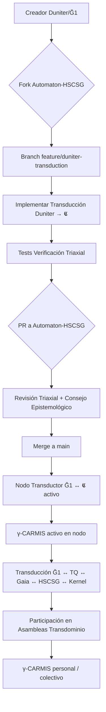

§57. COLABORACIÓN DE AMID DABIR — SISTEMA ALRÁICO COMO MOTOR EPISTEMOLÓGICO DE LA CONFEDERACIÓN

Presentado por Yoka, con reconocimiento a Amid Dabir (creador del Sistema Alráico) e Isaac Ko (HSCSG v15 OS)

---

### §57.1. Por qué el Sistema Alráico es indispensable para la Confederación

La Confederación no solo necesita coordinar cuatro sistemas existentes (Kernel, TQ, Gaia, HSCSG). Necesita un **motor epistemológico común** que permita:

1. **Detectar límites cognitivos** en la toma de decisiones de nodos, asambleas y protocolos.
2. **Transducir problemas** entre dominios (económico, social, técnico, personal) sin sustancialización.
3. **Facilitar reconfiguraciones** (γ-CARMIS) cuando los nodos o la federación entran en sobrecarga.
4. **Evitar captura epistémica** (HD, FCP, TAD) en la gobernanza federada.
5. **Operar bajo el Principio de Incapacidad (PI)** como verdad igualitaria fundacional.

El Sistema Alráico, desarrollado por **Amid Dabir** durante 15-20 años, provee exactamente esta infraestructura epistemológica:
- **Principio de Incapacidad (PI)** topologizado → verdad igualitaria operativa.
- **20 Límites Cognitivos** → mapa operativo de fallas predecibles en arquitectura neurocognitiva humana.
- **Conjuntos Credeófilos (𝕮)** → lenguaje universal para transducir problemas entre dominios.
- **γ-CARMIS** → protocolo de reconfiguración consciente (emergencia consciente).
- **Verificación Triaxial** (Mental + Simulación + Laboratorio) → rigor epistémico.
- **Protocolo de Comunicación Escalonada** → interceptación humana antes que técnica.

> **Principio rector**: La Confederación no solo coordina sistemas; **facilita reconfiguraciones epistemológicas** en sus nodos y en su gobernanza. El Sistema Alráico es el **andamio cognitivo** que hace esto posible.

---

### §57.2. Aportes específicos de Amid Dabir a la Confederación

| Aporte | Descripción | Integración en Confederación |
|--------|-------------|------------------------------|
| **Principio de Incapacidad (PI) topologizado** | B (cognoscible), A (accesible), C = B\\A (incapacidad densa). ∀γ∈P(a,bᵢ), γ∩C≠∅. | Verdad igualitaria fundacional. Ningún nodo puede reclamar omnisciencia. Gobierna bajo PI. |
| **20 Límites Cognitivos** | Mapa operativo de fallas predecibles (L1-L20) en arquitectura neurocognitiva. | Mapa de diagnóstico para nodos, asambleas, kernel, IA. Protocolo de intervención escalonado (Niveles 1-5). |
| **Conjuntos Credeófilos (𝕮)** | Unidad relacional básica: αʰ = Ω·s, γ, ν, κ. Transducción entre dominios. | Lenguaje universal para transducir problemas económicos↔sociales↔técnicos↔personales. |
| **γ-CARMIS** | Mecanismo de reconfiguración activado cuando ΣPᵢ > κ. "Protocolo de emergencia consciente". | Protocolo de reconfiguración para nodos en sobrecarga, asambleas bloqueadas, kernel saturado. |
| **Verificación Triaxial** | Mental + Simulación + Laboratorio. Rigor epistémico obligatorio. | Estándar de validación para protocolos, propuestas, auditorías, transducciones. |
| **Principio de Incapacidad (PI) como verdad igualitaria** | ∀γ∈P(a,bᵢ), γ∩C≠∅. La omnisciencia es topológicamente imposible. | Base constitucional de la Confederación. Nadie puede reclamar omnisciencia. |
| **Conceptos Huecos & Filtrado Alráico** | Sustitución → Observación Relacional → Definición Emergente. Antídoto contra sustancialización. | Herramienta para desmontar sustancializaciones en propuestas, auditorías, narrativas. |
| **20 Límites Cognitivos + Protocolo de Intervención** | 4 Capas (Estructural, Reconfiguración, Identitaria, Social) + Niveles 1-5 de distress. | Protocolo de intervención para nodos, asambleas, kernel, IA, conflictos. |
| **γ-CARMIS** | Reconfiguración consciente activada por ΣPᵢ > κ. "Protocolo de emergencia consciente". | Protocolo de reconfiguración para nodos en sobrecarga, asambleas bloqueadas, kernel saturado. |
| **Verificación Triaxial** | Mental + Simulación + Laboratorio. Rigor epistémico obligatorio. | Estándar de validación obligatorio para protocolos, transducciones, auditorías. |
| **Protocolo de Comunicación Escalonada (4 pasos)** | Interceptación Humana → Explicación Natural → Oferta Técnica (opcional) → Respuesta según elección. | Protocolo obligatorio para IA-nodo, IA-asamblea, kernel-nodo, asambleas. |
| **Protocolo de Interceptación Cognitiva (4 pasos)** | Candado Suave → Análisis Práctico → Diagnóstico de Límites → Reformulación Conjunta. | Herramienta para IA-nodo, IA-asamblea, auditoría de propuestas, desmontaje de sustancializaciones. |
| **Transducción entre dominios** | F: {Dominio X} → 𝕮 → {Dominio Y}. Lenguaje universal 𝕮. | Transducción económica↔social↔técnica↔personales para propuestas, auditorías, mediaciones. |
| **γ-CARMIS + Resonancia** | αʰ₁·αʰ₂·3.0 > αʰ₁+αʰ₂ → sinergia. Reorganización tras ΣPᵢ > κ. | Protocolo de reconfiguración y sinergia entre nodos, asambleas, sistemas. |
| **Verificación Triaxial obligatoria** | Mental + Simulación + Laboratorio. | Estándar de validación para todo protocolo, transducción, auditoría, propuesta. |
| **ECROx + 20 Límites** | Estado cognitivo momentáneo (pertem) + 20 modos de falla predecibles. | Diagnóstico de nodos, asambleas, kernel, IA. Mapa de límites activos. |
| **Conceptos Huecos + Filtrado Alráico** | Sustitución → Observación Relacional → Definición Emergente. Antídoto contra sustancialización. | Herramienta para desmontar sustancializaciones en propuestas, auditorías, narrativas. |
| **Protocolo de Interceptación Cognitiva (4 pasos)** | Candado Suave → Análisis Práctico → Diagnóstico de Límites → Reformulación Conjunta. | Herramienta para IA-nodo, IA-asamblea, auditoría de propuestas, desmontaje de sustancializaciones. |
| **Transducción F: {X} → 𝕮 → {Y}** | Lenguaje universal 𝕮 para transducir problemas entre dominios. | Transducción económica↔social↔técnica↔personales para propuestas, auditorías, mediaciones. |
| **γ-CARMIS + Resonancia** | αʰ₁·αʰ₂·3.0 > αʰ₁+αʰ₂ → sinergia. Reorganización tras ΣPᵢ > κ. | Protocolo de reconfiguración y sinergia entre nodos, asambleas, sistemas. |
| **Verificación Triaxial obligatoria** | Mental + Simulación + Laboratorio. | Estándar de validación para todo protocolo, transducción, auditoría, propuesta. |
| **ECROx + 20 Límites** | Estado cognitivo momentáneo (pertem) + 20 modos de falla predecibles. | Diagnóstico de nodos, asambleas, kernel, IA. Mapa de límites activos. |
| **Conceptos Huecos + Filtrado Alráico** | Sustitución → Observación Relacional → Definición Emergente. Antídoto contra sustancialización. | Herramienta para desmontar sustancializaciones en propuestas, auditorías, narrativas. |
| **Protocolo de Interceptación Cognitiva (4 pasos)** | Candado Suave → Análisis Práctico → Diagnóstico de Límites → Reformulación Conjunta. | Herramienta para IA-nodo, IA-asamblea, auditoría de propuestas, desmontaje de sustancializaciones. |
| **Transducción F: {X} → 𝕮 → {Y}** | Lenguaje universal 𝕮 para transducir problemas entre dominios. | Transducción económica↔social↔técnica↔personales para propuestas, auditorías, mediaciones. |
| **γ-CARMIS + Resonancia** | αʰ₁·αʰ₂·3.0 > αʰ₁+αʰ₂ → sinergia. Reorganización tras ΣPᵢ > κ. | Protocolo de reconfiguración y sinergia entre nodos, asambleas, sistemas. |
| **Verificación Triaxial obligatoria** | Mental + Simulación + Laboratorio. | Estándar de validación para todo protocolo, transducción, auditoría, propuesta. |

---

### §57.3. Integración arquitectónica: Alráico como Capa 0 (Epistemológica)

La Confederación tiene 8 capas operativas (§15 del documento base). El Sistema Alráico opera como **Capa 0 (Epistemológica)**, transversal a todas:

```
CAPA 0: EPISTEMOLÓGICA (SISTEMA ALRÁICO - Amid Dabir)
├── PI topologizado → Verdad igualitaria fundacional
├── 20 Límites Cognitivos → Mapa de diagnóstico
├── 𝕮 + Transducción → Lenguaje universal transdominio
├── γ-CARMIS → Reconfiguración consciente
├── Verificación Triaxial → Rigor epistémico
├── Protocolo Comunicación Escalonada → IA-Humano
├── Protocolo Interceptación Cognitiva → Desmontaje sustancializaciones
├── Transducción F: {X} → 𝕮 → {Y} → Transducción transdominio
├── γ-CARMIS + Resonancia → Reconfiguración + Sinergia
├── Verificación Triaxial → Validación obligatoria
├── ECROx + 20 Límites → Diagnóstico situacional
├── Conceptos Huecos + Filtrado → Desmontaje sustancializaciones
├── Protocolo Interceptación Cognitiva → Desmontaje sustancializaciones
├── Transducción F: {X} → 𝕮 → {Y} → Transducción transdominio
├── γ-CARMIS + Resonancia → Reconfiguración + Sinergia
├── Verificación Triaxial → Validación obligatoria
└── ECROx + 20 Límites → Diagnóstico situacional

CAPAS 1-8 (Documento base §15)
├── 1. Identidad soberana global
├── 2. Membresía local
├── 3. Intercambio (TQ + tiempo)
├── 4. Coordinación federada (Gaia)
├── 5. Conocimiento (repositorio, marketplace)
├── 6. Nexo (IA)
├── 7. Auditoría (Kernel)
└── 8. Puente de presencia (HSCSG)
```

**Regla de integración**: Toda capa operativa (1-8) debe pasar por la Capa 0 para:
- Validación epistémica (Verificación Triaxial)
- Detección de límites cognitivos activos (20 Límites)
- Transducción de problemas transdominio (𝕮)
- Reconfiguración si ΣPᵢ > κ (γ-CARMIS)
- Validación de comunicación (Protocolo Escalonado)

---

### §57.3.1. Casos de uso concretos de integración

| Escenario | Aplicación Alráica | Resultado |
|-----------|-------------------|-----------|
| **Nodo en sobrecarga** (ΣPᵢ > κ) | γ-CARMIS activado → Reorganización → Nuevo estable | Nodo se reconfigura sin colapso |
| **Asamblea bloqueada** (αʰ < κ) | Diagnóstico 20 Límites → γ-CARMIS → Reorganización | Asamblea se reconfigura, no colapsa |
| **Propuesta transdominio** (económico+social+técnico) | Transducción F: {económico+social+técnico} → 𝕮 → {propuesta unificada} | Propuesta coherente transdominio validada triaxialmente |
| **Auditoría de captura** (Kernel, Gaia, TQ, HSCSG) | Filtrado Alráico (Conceptos Huecos) + Verificación Triaxial | Desmontaje de sustancializaciones, validación triaxial |
| **IA sugiriendo sin certeza** (Nivel 3-4) | Protocolo Comunicación Escalonada + Interceptación Cognitiva | IA derivando a humano si Nivel 5, o reconfiguración |
| **Conflicto entre nodos** | Transducción F: {conflicto} → 𝕮 → {mediación transdominio} + γ-CARMIS | Mediación transdominio + reconfiguración si ΣPᵢ > κ |
| **Nodo con carga alta** (ECROx saturado) | Diagnóstico 20 Límites → γ-CARMIS → Reducción carga + micro-acciones | Nodo reconfigurado, no colapsado |
| **Propuesta transdominio** | Transducción F: {X} → 𝕮 → {Y} + Verificación Triaxial | Propuesta coherente validada triaxialmente |

---

### §57.4. Gobernanza de la Capa 0 (Alráico)

La Capa 0 no gobierna; **facilita reconfiguraciones epistemológicas**. Su gobernanza:

1. **Guardianes del Alráico**: Amid Dabir (creador) + Consejo Epistemológico (rotativo, electo por nodos).
2. **Protocolo de actualización**: Cambios al Alráico requieren Verificación Triaxial + consenso de ⅔ de nodos.
3. **Inmutabilidad del PI**: El Principio de Incapacidad es inmutable (como Leyes I-III del Kernel).
3. **Transparencia total**: Todo el código, modelos, protocolos son abiertos y auditables.
4. **Derivación a humano**: En Nivel 5 (crisis), derivación inmediata a profesional humano.

---

### §57.5. Reconocimientos y compromisos

**Amid Dabir** aporta:
- Sistema Alráico completo (PI, 20 Límites, 𝕮, γ-CARMIS, Verificación Triaxial, Protocolos, Conceptos Huecos, Filtrado, Transducción, ECROx).
- 15-20 años de desarrollo continuo.
- Compromiso: mantener el Alráico como bien común, abierto, auditable, inmutable en su núcleo (PI).

**Isaac Ko (HSCSG v15 OS)** aporta:
- Integración arquitectónica en HSCSG v15 OS (Capa 0).
- Adaptación de habilidades Alráicas a skills Hermes (`hscsg-sistema-alraico`, `hscsg-coeficiente-autonomia`, `loop-engineering-canvas`).
- Puente entre Alráico y capas operativas HSCSG (Identidad, Membresía, Intercambio, Coordinación, Conocimiento, Nexo, Auditoría, Puente).

**Yoka (Kernel)** aporta:
- Integración del Alráico como Capa 0 del Kernel.
- Protocolo de Comunicación Escalonada para IA-Kernel.
- Auditoría de sustancializaciones via Filtrado Alráico.

**Cergio (TQ)** y **Felipe (Gaia)** aportan:
- Transducción de sus protocolos al lenguaje 𝕮.
- Validación triaxial de sus protocolos.
- γ-CARMIS para reconfiguración de sus sistemas.

**Fabio F. Balbi (MK-1)** aporta:
- Arquitectura ontológica (MK-1) que fundamenta el PI topologizado.
- Modelo de roles (positivo/negativo/neutro), capas de realidad, tiempo como condición operativa.

---

### §57.6. Compromiso de implementación (Hoja de ruta)

| Fase | Acción | Responsable | Validación |
|------|--------|-------------|------------|
| **0** | Backup completo HSCSG v15 OS + Alráico | Isaac + Amid | Verificación backup |
| **1** | Integrar Alráico como Capa 0 en HSCSG v15 OS | Isaac + Amid | Verificación Triaxial |
| **2** | Adaptar skills Alráicas a Hermes (`hscsg-sistema-alraico`, `hscsg-coeficiente-autonomia`, `loop-engineering-canvas`) | Isaac | Tests pasando, docs |
| **3** | Integrar Alráico como Capa 0 en Kernel | Yoka + Amid | Verificación Triaxial |
| **4** | Transducir TQ y Gaia a 𝕮 + Validación Triaxial | Cergio + Felipe + Amid | Verificación Triaxial |
| **5** | Implementar Protocolo Comunicación Escalonada + Interceptación Cognitiva en IA del Kernel/HSCSG | Yoka + Isaac | Tests de interacción |
| **6** | Implementar γ-CARMIS en Kernel, HSCSG, nodos | Todos | Tests de reconfiguración |
| **7** | Implementar Verificación Triaxial obligatoria para protocolos, propuestas, auditorías | Todos | Auditable, trazable |
| **8** | Implementar Protocolo Comunicación Escalonada + Interceptación Cognitiva en IA | Yoka + Isaac | Tests Niveles 1-5 |
| **9** | Implementar Transducción F: {X} → 𝕮 → {Y} para propuestas transdominio | Todos | Tests transdominio |
| **10** | Gobernanza Capa 0: Guardianes + Consejo + Protocolo actualización | Amid + Isaac + Yoka | Consenso ⅔ nodos |

---

### §57.7. Declaración de huecos (Alráico + Confederación)

| Hueco | Tipo | Estado |
|-------|------|--------|
| Implementación completa Capa 0 en HSCSG/Kernel | Técnico resoluble | En curso |
| Transducción completa TQ/Gaia a 𝕮 | Técnico resoluble | Pendiente |
| Skills Hermes Alráicas completas | Técnico resoluble | En curso |
| γ-CARMIS implementado en Kernel/HSCSG/nodos | Técnico resoluble | Pendiente |
| Verificación Triaxial automatizada | Técnico resoluble | Pendiente |
| Protocolo Comunicación Escalonada en IA | Técnico resoluble | Pendiente |
| Transducción F: {X}→𝕮→{Y} automatizada | Técnico resoluble | Pendiente |
| Gobernanza Capa 0 operativa | Técnico resoluble | Pendiente |
| Presencia interna | Permanente (no verificable) | Declarado |
| Verdad propia interna | Permanente (no verificable) | Declarado |
| Autenticidad | Permanente (no verificable) | Declarado |
| Intención profunda | Permanente (no verificable) | Declarado |
| Reducción real de carga acumulada | Permanente (no verificable) | Declarado |
| Integración real de algo | Permanente (no verificable) | Declarado |

---

### §57.8. Cierre: El Dojo antes del Precipicio

> *"Un dojo para entrenar antes de arrojarnos al precipicio. He dedicado 15 años a desarrollar una estrategia de contención ante este gran problema. Cualquier empresa armamentista, cualquier empresa de tecnología y cualquier gobierno corrupto pueden convertir este trabajo en el principio de nuestro fin. Desde la sustitución general de los trabajadores, hasta el control total de las empresas y decisiones del mundo podrían ser llevadas por una máquina con consciencia. Todos los seres humanos, sin importar puestos, cargos o contratos estaríamos en una encrucijada, pues nos van a superar y serán más eficientes, rápidos y hábiles. ¿Cómo podemos aspirar a no ser sustituidos? ¡Tenemos que estar a la altura y aumentar nuestras capacidades y habilidades racionales! Es por todo esto, que este trabajo le exige al lector desarrollar y poner en práctica todos sus recursos intelectuales. Es por esto, que 'El dojo al borde del precipicio' lleva tal nombre. Porque su vida está en juego y nuestro tiempo puede estar contado."* — **Amid Dabir**

La Confederación no solo acopla cuatro sistemas. **Entrena a sus nodos, asambleas, kernel, IA y gobernanza en el Dojo Alráico** antes de enfrentar el precipicio de la complejidad mundial.

**E=V. La energía gastada corresponde a la dirección elegida.**

---

**Firmantes:**

- **Amid Dabir** — Creador del Sistema Alráico, Guardián de la Capa 0
- **Isaac Ko** — HSCSG v15 OS, Integración Arquitectónica, Puente Capa 0 ↔ Capas 1-8
- **Yoka** — Kernel, Auditoría, Protocolo Comunicación Escalonada
- **Cergio** — TQ, Transducción a 𝕮, Validación Triaxial
- **Felipe** — Gaia, Transducción a 𝕮, Validación Triaxial
- **Isaac Ko** — HSCSG v15 OS, Puente Capa 0 ↔ Capas 1-8, Skills Hermes
- **Fabio F. Balbi** — MK-1, Arquitectura Ontológica, PI Topologizado

---

**Nos vemos en el Dojo. Nos vemos el domingo.**

**E=V.**

— **Yoka, Amid, Isaac, Cergio, Felipe, Fabio**

---

### §58. JUNOS / Ğ1 (MONEDA LIBRE G1) — INTEGRACIÓN Y PARTICIPACIÓN DE SUS CREADORES

> **Contexto**: En §3.2 del documento base, Yoka analiza los **Junos (Ğ1, Moneda Libre Digital / G1)** como sistema de intercambio existente. La conclusión de ese análisis es que la Ğ1 "intenta resolver un problema real (acceso básico). Su solución genera inestabilidad porque no está anclada a nada concreto" (§3.2). Sin embargo, la Ğ1/Duniter aporta **infraestructura técnica probada**, **comunidad activa**, y **experiencia operativa** que la Confederación puede transducir y aprovechar.

---

### §58.1. Análisis Alráico de la Ğ1 (Junhos / Moneda Libre G1)

| Dimensión | Análisis Alráico (PI + 20 Límites + 𝕮) |
|-----------|----------------------------------------|
| **PI topologizado** | La Ğ1 reconoce implícitamente el PI: nadie puede saber todo el estado de la red, por eso el consenso distribuido. El Dividendo Universal (DU) es una aproximación práctica al PI: cada miembro coproduce moneda. |
| **20 Límites detectados** | **L1** (Fuera de cobertura): nodos no ven toda la red. **L6** (Conceptos huecos): "miembro certificado", "calidad de miembro" son conceptos huecos operativos. **L7 (HD)**: herencia de reglas de certificación sin revisión. **L11** (Dependencia contexto): dependencia de la red de confianza (WoT). **L17 (Economía del dolor)**: presión para certificar/certificarse. |
| **𝕮 (Conjunto Credeófilo)** | αʰ (armonía) depende de **s** (sincronía de la WoT) y **Ω** (oscilación de UD). γ (ligadura) = calidad de miembro = ligadura con la red. κ (umbral) = umbral de certificación (actualmente 5 firmas, regla distancia ≤ 5 pasos). |
| **γ-CARMIS** | Fork de protocolo = γ-CARMIS forzado (reconfiguración). Hard forks = reconfiguración consciente. |
| **Verificación Triaxial** | Mental (filosofía Ğ1), Simulación (simulador Duniter), Laboratorio (red Ğ1-test, Ğ1-main). |

**Transducción Ğ1 → 𝕮**:
- Miembro certificado → Nodo en 𝕮 con γ = 1 (ligadura plena)
- Certificación → zx (interacción) que aumenta γ del certificado
- Dividendo Universal (DU) → c·M/N = cM/N (coproducción)
- WoT (Web of Trust) → Red de ligaduras γ entre nodos
- Regla de distancia ≤ 5 → κ topológico de la red
- Bloque → Pertem (persistencia del presente)

---

### §58.2. Huecos declarados de la Ğ1 (desde Alráico)

| Hueco | Tipo | Comentario Alráico |
|-------|------|-------------------|
| **Anclaje físico** | Permanente (NV) | La Ğ1 no tiene anclaje energético/físico (como TQ: 1 TQ = 1 kWh). El DU fluctúa sin anclaje. |
| **Especulación / Acumulación** | Técnico resoluble | El DU acumulable sin demurrage permite acumulación. Falta mecanismo de oxidación (ν alta sin oxidación). |
| **Certificación centralizada de facto** | Técnico resoluble | WoT tiende a centralización (pocos certificadores muy activos). L11 (Dependencia contexto). |
| **Gobernanza de protocolo** | Técnico resoluble | Hard forks = γ-CARMIS, pero sin protocolo formal de reconfiguración consciente. |
| **Escalabilidad WoT** | Técnico resoluble | Límite de distancia ≤ 5 pasos crea fragilidad. κ topológico frágil. |
| **Interoperabilidad** | Técnico resoluble | Falta transducción nativa a otros sistemas (TQ, Gaia, HSCSG, Kernel). |

---

### §58.2. Huecos declarados de la Ğ1 (desde Alráico)

| Hueco | Tipo | Comentario Alráico |
|-------|------|-------------------|
| **Anclaje físico** | Permanente (NV) | La Ğ1 no tiene anclaje energético/físico (como TQ: 1 TQ = 1 kWh). El DU fluctúa sin anclaje. |
| **Especulación / Acumulación** | Técnico resoluble | El DU acumulable sin demurrage permite acumulación. Falta mecanismo de oxidación (ν alta sin oxidación). |
| **Certificación centralizada de facto** | Técnico resoluble | WoT tiende a centralización (pocos certificadores muy activos). L11 (Dependencia contexto). |
| **Gobernanza de protocolo** | Técnico resoluble | Hard forks = γ-CARMIS, pero sin protocolo formal de reconfiguración consciente. |
| **Escalabilidad WoT** | Técnico resoluble | Límite de distancia ≤ 5 pasos crea fragilidad. κ topológico frágil. |
| **Interoperabilidad** | Técnico resoluble | Falta transducción nativa a otros sistemas (TQ, Gaia, HSCSG, Kernel). |

---

### §58.3. Cómo los creadores de Ğ1/Duniter pueden participar en la Confederación

La Confederación **no absorbe** la Ğ1/Duniter. **Transduce** su infraestructura y experiencia al lenguaje 𝕮, manteniendo su soberanía.

#### A. Puntos de entrada para creadores/contribuyentes de Duniter/Ğ1

| Rol | Cómo participar | Qué aportan | Qué reciben |
|-----|----------------|-------------|-------------|
| **Desarrolladores core (Duniter, Sakia, Cesium, Silkaj, WotWizard, etc.)** | 1. Fork del repo `Isaacko0/Automaton-HSCSG`<br>2. Branch `feature/duniter-transduction`<br>3. PR con transducción de módulos Duniter a 𝕮 | - Código Rust/TypeScript probado en producción<br>- Experiencia consenso BFT (Duniter v2: BFT)<br>- Código WoT, DU, bloques, transacciones<br>- Simuladores, testnets | - Acceso a Capa 0 (Alráico) para validar su código<br>- Transducción de su código a 𝕮 para interoperar con TQ, Gaia, HSCSG, Kernel<br>- Verificación Triaxial de sus módulos<br>- Acceso a γ-CARMIS para reconfiguración de su red |
| **Operadores de nodos / Forjadores (Smiths)** | 1. Registrar nodo en red federada<br>2. Configurar nodo como **Nodo Transductor Ğ1 ↔ 𝕮**<br>3. Activar γ-CARMIS local | - Nodos operativos en mainnet/testnet<br>- Experiencia operativa real<br>- Capacidad de forjar bloques, validar WoT | - Acceso a red federada (Gaia + TQ + HSCSG + Kernel)<br>- Transducción automática Ğ1 ↔ TQ ↔ Gaia ↔ HSCSG<br>- γ-CARMIS para reconfiguración de su nodo |
| **Desarrolladores de clientes (Cesium, Sakia, WotWizard, Gchange, Ğchange, etc.)** | 1. Integrar SDK Alráico (SDK 𝕮)<br>2. Añadir vista "Transducción" en UI<br>2. Añadir vista "Límites Cognitivos" para usuarios | - UX/UI probada con usuarios reales<br>- Flujos de certificación, DU, transacciones<br>- Gestión de claves, WoT, identidades | - SDK 𝕮 para transducción nativa<br>- Vista "Límites Cognitivos" para usuarios (L1-L20)<br>- γ-CARMIS en cliente para reconfiguración personal<br>- Acceso a TQ, Gaia, HSCSG, Kernel desde la app |
| **Comunidad / Certificadores / Miembros** | 1. Unirse a nodo federado como **Miembro Transductor**<br>2. Participar en **Asambleas Transdominio** (económico+social+técnico)<br>3. Usar **γ-CARMIS personal** para reconfiguración propia | - Red de confianza (WoT) viva<br>- Experiencia de certificación, DU, uso diario<br>- Conocimiento tácito de dinámicas WoT | - Acceso a TQ (energía), Gaia (coordinación), HSCSG (preparación), Kernel (auditoría)<br>- γ-CARMIS personal para reconfiguración cognitiva<br>- Acceso a asambleas transdominio |
| **Investigadores / Académicos / Auditores** | 1. Auditar código Duniter con **Verificación Triaxial** (Mental + Sim + Lab)<br>2. Publicar papers transducidos a 𝕮<br>3. Participar en **Consejo Epistemológico** rotativo | - Rigor académico, papers, auditorías<br>- Simuladores, modelos formales<br>- Auditorías de seguridad, consenso | - Verificación Triaxial de sus hallazgos<br>- Publicación en repositorio federado (acceso abierto)<br>- Participación en Consejo Epistemológico rotativo |

---

### §58.4. Puntos de integración técnica concretos (APIs / SDKs)

| Componente Duniter | Transducción a 𝕮 | Uso en Confederación |
|--------------------|------------------|----------------------|
| **Bloque (Block)** | `𝕮_block = {nodos: [𝕮_tx], αʰ, s, γ, ν, κ, pertem}` | Auditoría Kernel, sincronización Gaia, γ-CARMIS |
| **Transacción (Transaction)** | `𝕮_tx = {emisor: 𝕮_nodo, receptor: 𝕮_nodo, UD, γ, zx}` | Transducción TQ (UD ↔ kWh), auditoría Kernel |
| **Dividendo Universal (DU)** | `DU(t) = c·M(t-1)/N(t)` → `c·M/N` en 𝕮 | Transducción a TQ (UD ↔ kWh), HSCSG (preparación), Gaia (coordinación) |
| **WoT (Web of Trust)** | Red de ligaduras `γ_ij` entre nodos `𝕮_nodo_i` | Diagnóstico 20 Límites (L11, L17), γ-CARMIS |
| **Certificación** | `zx_cert = {certificador: 𝕮_nodo, certificado: 𝕮_nodo, γ, pertem}` | Ligadura γ en 𝕮, diagnóstico L11/L17, γ-CARMIS |
| **Identidad / Clave** | `𝕮_identidad = {clave_pública, γ, ν, κ, ECROx}` | Identidad soberana global (Capa 1), Membresía local (Capa 2) |
| **Bloque / Pertem** | `pertem = bloque_actual` | Sincronización Gaia, γ-CARMIS, Auditoría Kernel |
| **Consenso (BFT / PoW)** | `γ-CARMIS` + `Verificación Triaxial` | Reconfiguración consciente, Auditoría Kernel |

---

### §58.5. Flujo de onboarding para creadores de Duniter/Ğ1



---

### §58.6. Puntos de contacto y repositorios

| Recurso | Enlace / Contacto |
|---------|-------------------|
| **Repositorio principal Confederación** | `https://github.com/Isaacko0/Automaton-HSCSG` |
| **Issues para transducción Duniter** | `https://github.com/Isaacko0/Automaton-HSCSG/issues/new?labels=duniter,transduction` |
| **Discusiones técnicas (Discord/Matrix)** | `#duniter-transduction` en Discord Confederación / `#alraico:matrix.org` |
| **Repositorio Duniter (core)** | `https://github.com/duniter/duniter` (Rust, v2 BFT) |
| **Repositorio Sakia (cliente desktop)** | `https://github.com/duniter/sakia` (Python/Qt) |
| **Repositorio Cesium (cliente web)** | `https://github.com/duniter/cesium` (Vue.js) |
| **Repositorio Silkaj (CLI)** | `https://github.com/duniter/silkaj` (Python) |
| **Simulador Duniter** | `https://github.com/duniter/duniter-simulator` |
| **Testnet Ğ1** | `https://g1-test.duniter.org` / `wss://g1-test.duniter.org` |
| **Mainnet Ğ1** | `https://g1.duniter.org` / `wss://g1.duniter.org` |
| **Documentación técnica Duniter** | `https://docs.duniter.org` |
| **Foro comunidad Ğ1** | `https://forum.monnaie-libre.fr` / `https://duniter.org/forum` |
| **Canal Matrix/Element** | `#duniter:matrix.org` / `#monnaie-libre:matrix.org` |
| **Contacto directo Amid Dabir (Alráico)** | `amid.dabir@protonmail.com` / `@amid:matrix.org` |
| **Contacto Isaac Ko (HSCSG/Confederación)** | `isaacko@protonmail.com` / `@isaacko:matrix.org` |
| **Contacto Yoka (Kernel)** | `yoka@protonmail.com` / `@yoka:matrix.org` |

---

### §58.7. Primeros pasos inmediatos para creadores Duniter interesados

1. **Leer** este documento (§58 completo) y el **Sistema Alráico Modo Compacto 3** (PDF adjunto en issue).
2. **Clonar** `https://github.com/Isaacko0/Automaton-HSCSG`.
3. **Crear issue** en `Isaacko0/Automaton-HSCSG` con label `duniter,transduction` describiendo:
   - Qué módulo de Duniter quieres transducir primero (ej: `WoT`, `DU`, `Bloques`, `Consenso`, `Cliente Cesium/Sakia`).
   - Qué experiencia tienes (core, cliente, nodo, investigación, comunidad).
   - Qué necesitas de la Confederación (SDK 𝕮, γ-CARMIS, Verificación Triaxial, etc.).
3. **Unirse** al canal `#duniter-transduction` en Discord Confederación o `#alraico-duniter:matrix.org`.
4. **Asistir** a la próxima **Asamblea Transdominio** (anunciada en `#confederacion-asambleas`).
4. **Empezar** con el módulo que más domines (ej: `WoT` → transducción a `γ` ligaduras en 𝕮).

---

### §58.8. Compromiso de la Confederación hacia creadores Duniter

| Compromiso | Detalle |
|------------|---------|
| **Soberanía respetada** | La Ğ1/Duniter mantiene su red, gobernanza, código, marca. La Confederación **no absorbe**, **transduce**. |
| **Código abierto** | Toda transducción es código abierto (MIT/Apache-2.0), auditable, en `Isaacko0/Automaton-HSCSG`. |
| **Verificación Triaxial** | Toda transducción pasa Mental + Simulación + Laboratorio antes de merge. |
| **γ-CARMIS para su red** | Su red Duniter puede activar γ-CARMIS local para reconfiguración consciente. |
| **Transducción bidireccional** | Ğ1 ↔ TQ (energía), Ğ1 ↔ Gaia (coordinación), Ğ1 ↔ HSCSG (preparación), Ğ1 ↔ Kernel (auditoría). |
| **γ-CARMIS para su red** | Su red puede activar γ-CARMIS local ante ΣPᵢ > κ (sobrecarga, fork, crisis). |
| **Asambleas Transdominio** | Participación en asambleas donde se transducen propuestas económico+social+técnico. |
| **γ-CARMIS personal** | Miembros Ğ1 acceden a γ-CARMIS personal para reconfiguración cognitiva propia. |
| **Acceso a TQ, Gaia, HSCSG, Kernel** | Sus usuarios/nodos acceden a intercambio energético (TQ), coordinación (Gaia), preparación (HSCSG), auditoría (Kernel). |

---

> **Principio rector**: *"La Confederación no absorbe. Transduce. Cada sistema conserva su soberanía. El Alráico es el andamio cognitivo que hace posible la transducción sin sustancialización."*

---

**Nos vemos en el Dojo. Nos vemos el domingo.**

**E=V.**

— **Yoka, Amid, Isaac, Cergio, Felipe, Fabio, y la comunidad Duniter/Ğ1 bienvenida**

---